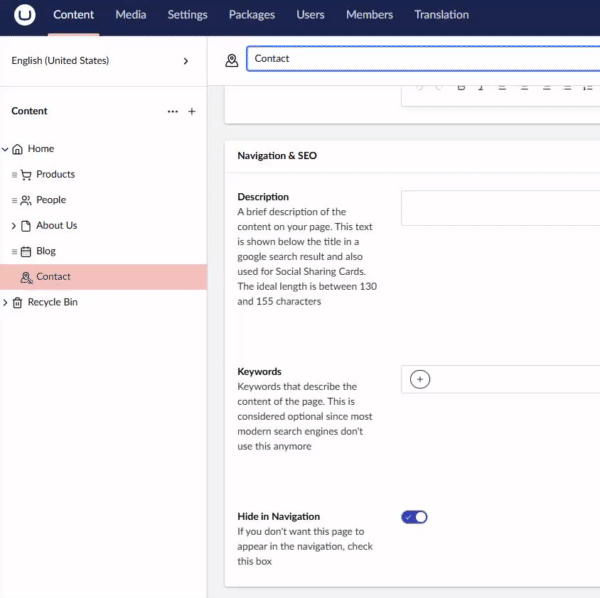
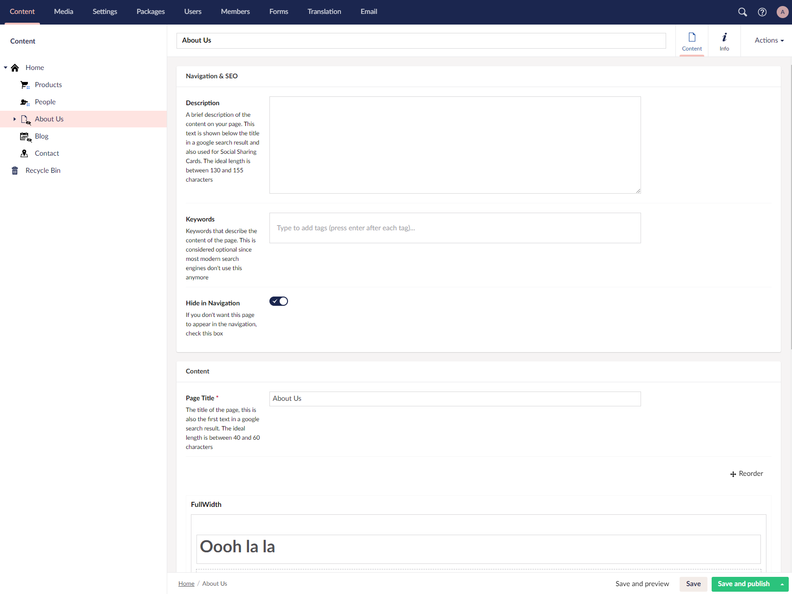

# UmbracoNaviHideIcon
UmbracoNaviHide is a umbraco v8+ package that displays an icon on the content nodes that are not visible on the front-end 


[](https://www.nuget.org/packages/Umbraconavihideicon)
[](https://our.umbraco.com/packages/backoffice-extensions/umbraconavihideicon/)




## Installation
Versionning
- 3.x.x is for Umbraco v17
- 2.x.x is for Umbraco v13
- 1.x.x is for Umbraco v8 - v10

### Umbraco v13+
```
PM> dotnet add package UmbracoNaviHideIcon
```

## Contributing

If you would like to help me improve this package, feel free to create a pull request!
Login details:
- Email: admin@admin.com 
- Password: password123

## Issues

If you find any issues with the package feel free to raise a issue!
